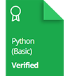

  

<h1 align="center">Hi, I'm Rifat Abrar Jowad 👋</h1>
<!--
**rifatabrarjowad/rifatabrarjowad** is a ✨ _special_ ✨ repository because its `README.md` (this file) appears on your GitHub profile.
-->

  

  

Here are some ideas to get you started:

- 🔭 I’m currently working on softasia
- 🌱 I’m currently learning python and js
- 👯 I’m looking to collaborate on any kind of web devlopment project
- 🤔 I’m looking for help  with Any kind of web devlopment project
- 💬 Ask me about php, js and python

## HackerRank Certificates

<h3 align="left">Connect with me:</h3>

<h3 align="left">Languages and Tools:</h3>

         

<h3 align="left">Support:</h3>

&nbsp;

📈 My GitHub Stats

# - 📫 How to reach me: 

 

